## Quiz:
* Which interface JDK tools use to connect to JVM locally?
  * JVMTI
* What is difference between profiling and traceability?
  * __Profiling:__ Used as a technique for measuring performance and optimizing the software for efficiency and focuses on runtime behavior and performance aspects of the software.
  * __Traceability:__ Used as a technique for tracking the lineage of each feature or component of the software to ensure it fulfills specified requirements and standards and focuses on monitoring how various pieces of the software are linked from requirements through to deployment.

## OutOfMemory (OOM) error troubleshooting
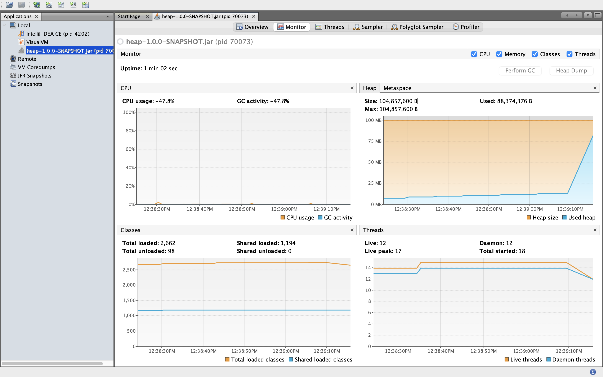
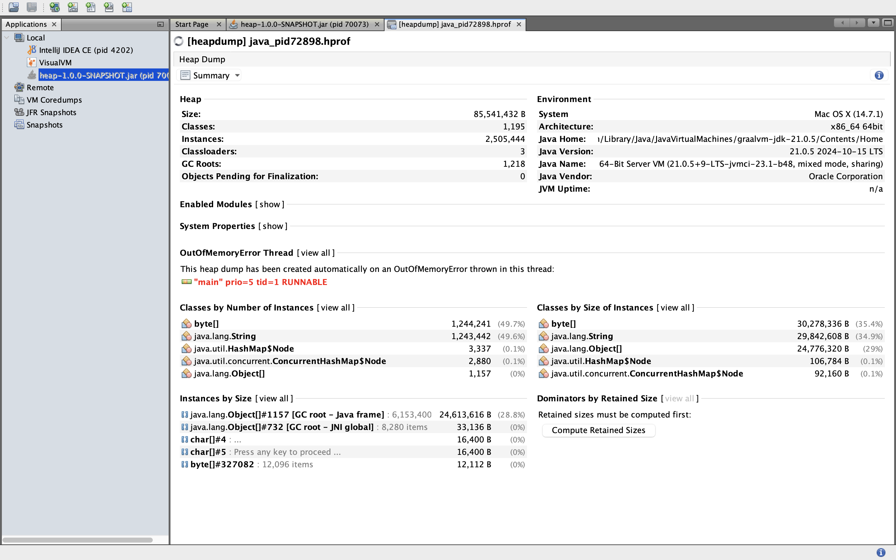
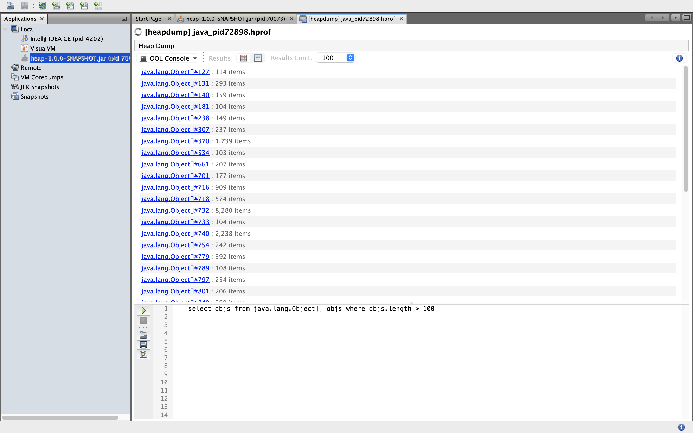
Query.png)
Query.png)

## Deadlock troubleshooting
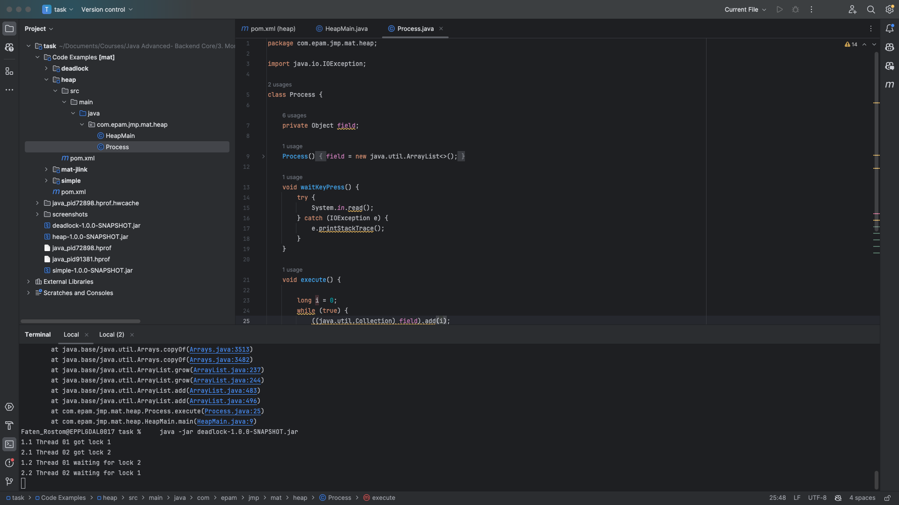
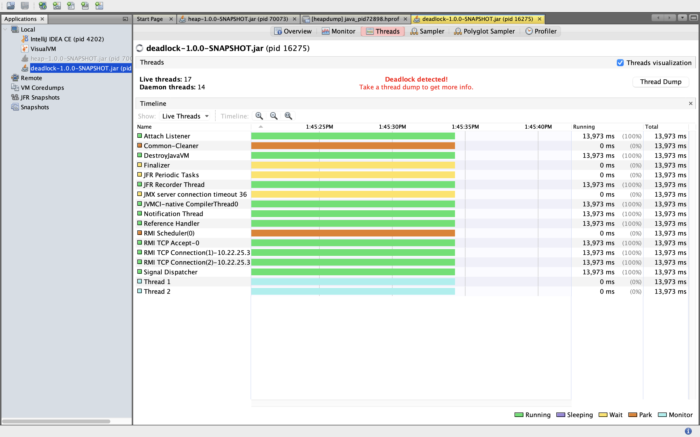
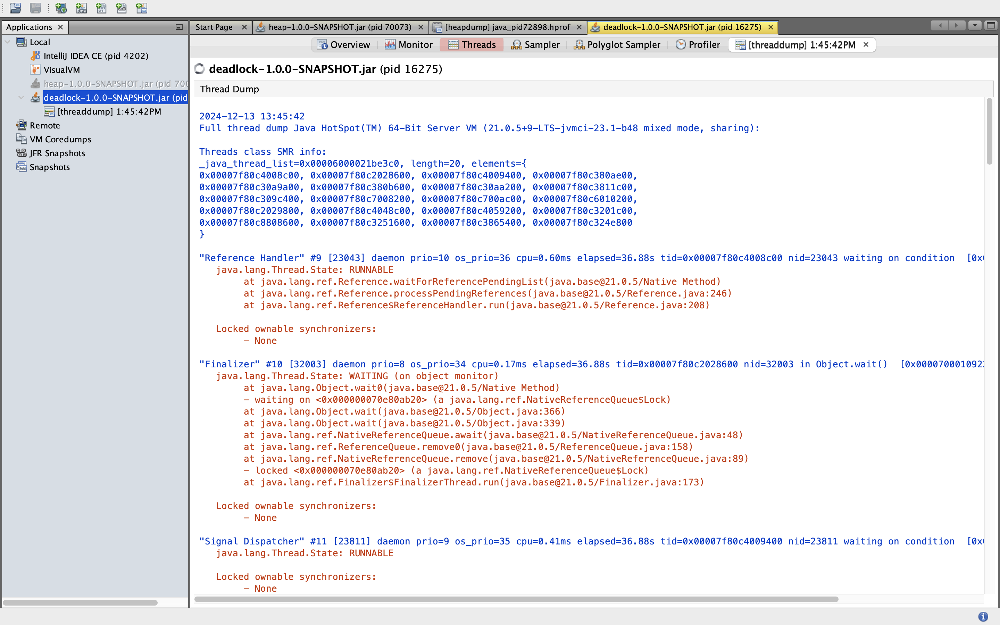
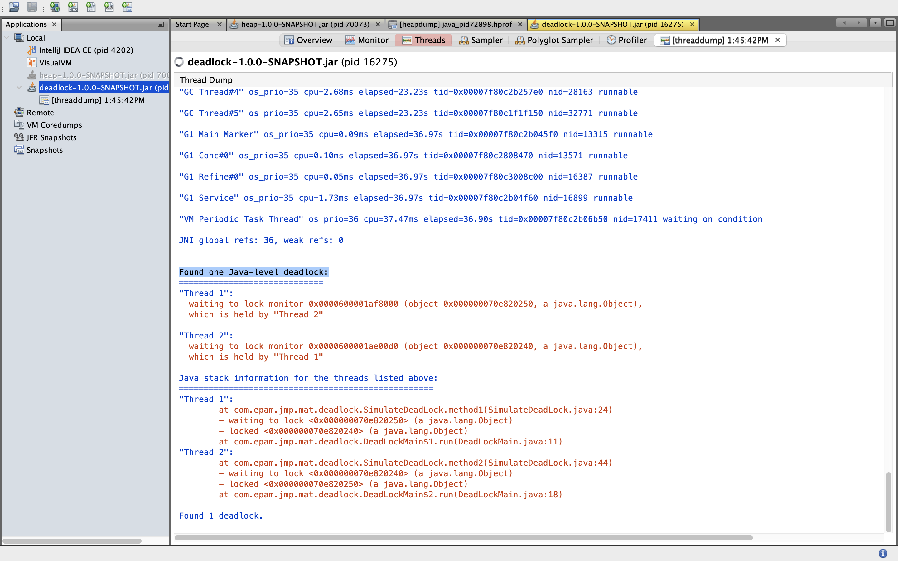
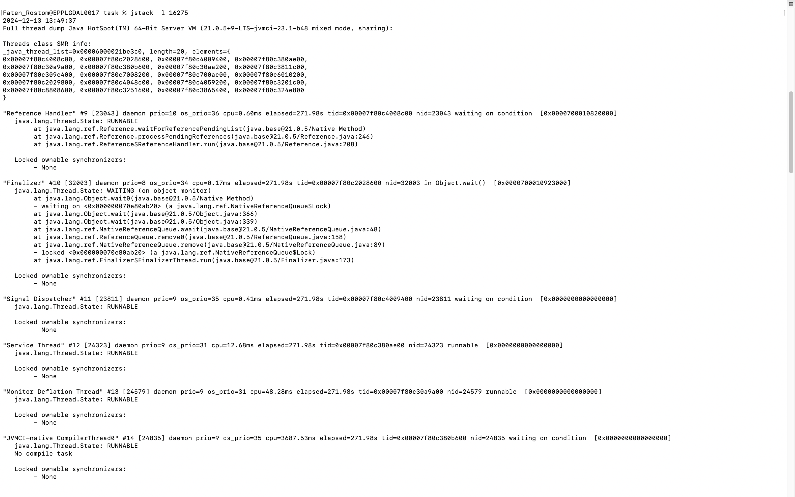
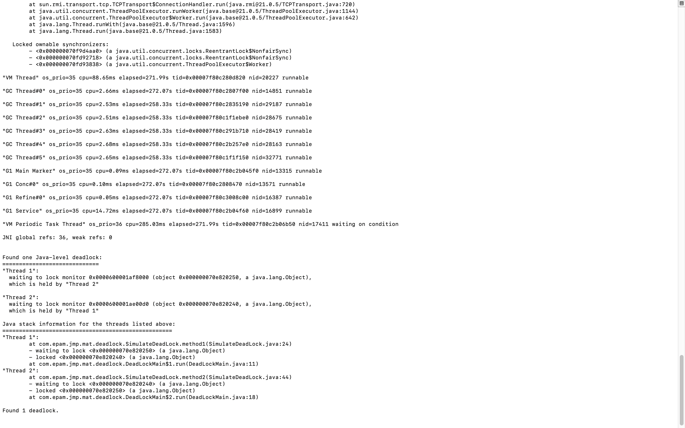

## Remote JVM profiling
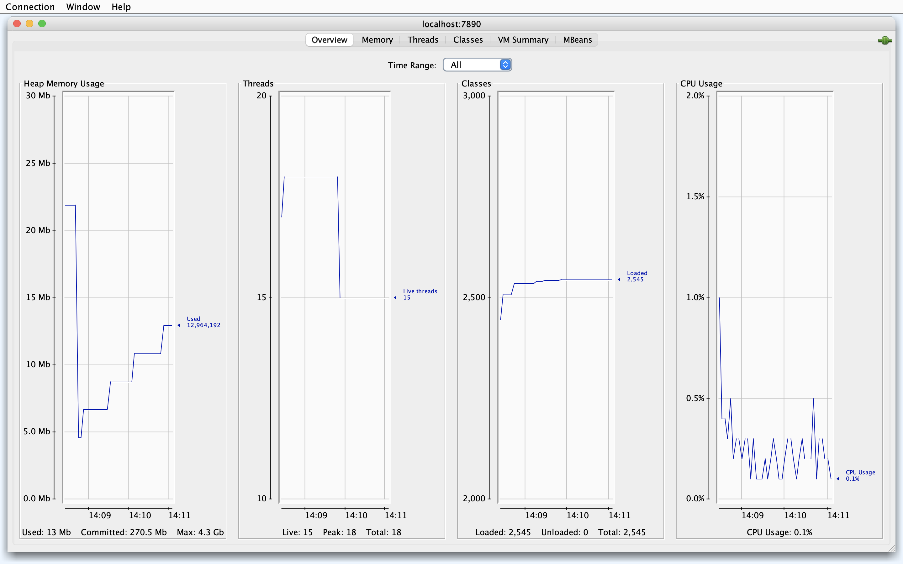
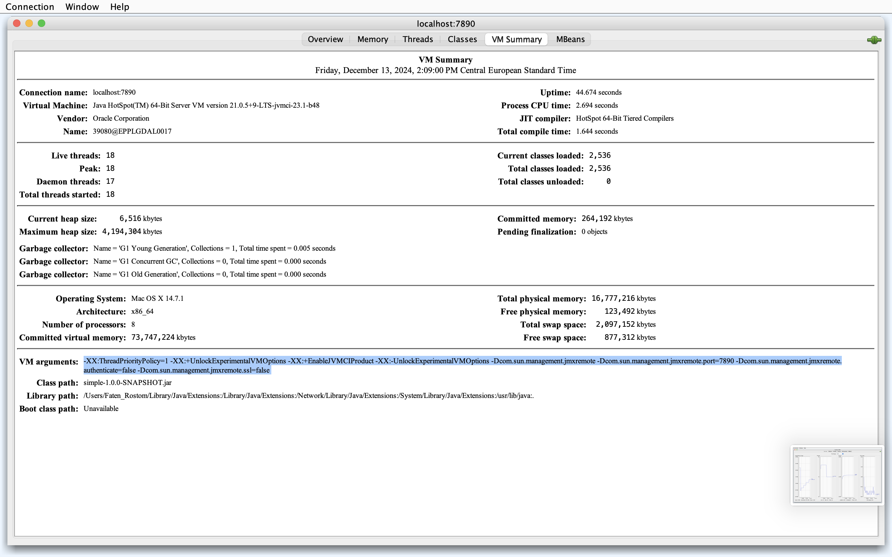

## Inspect a Flight Recording
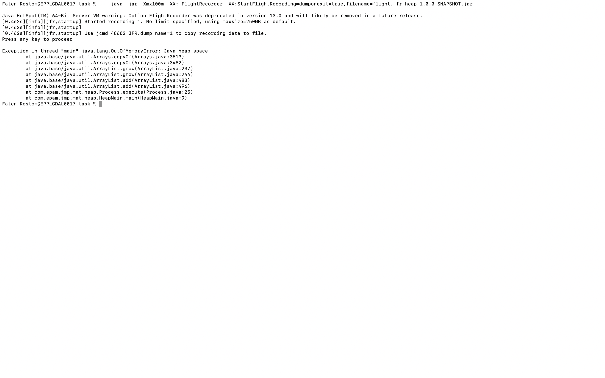
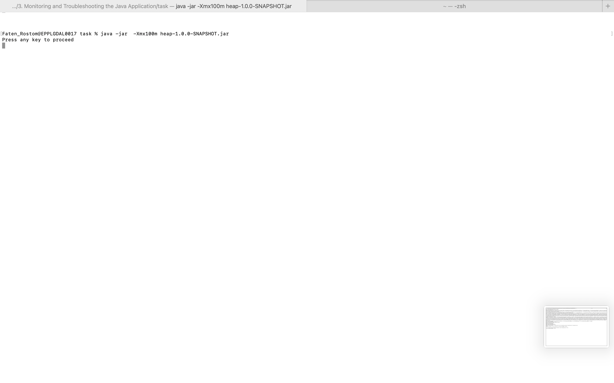
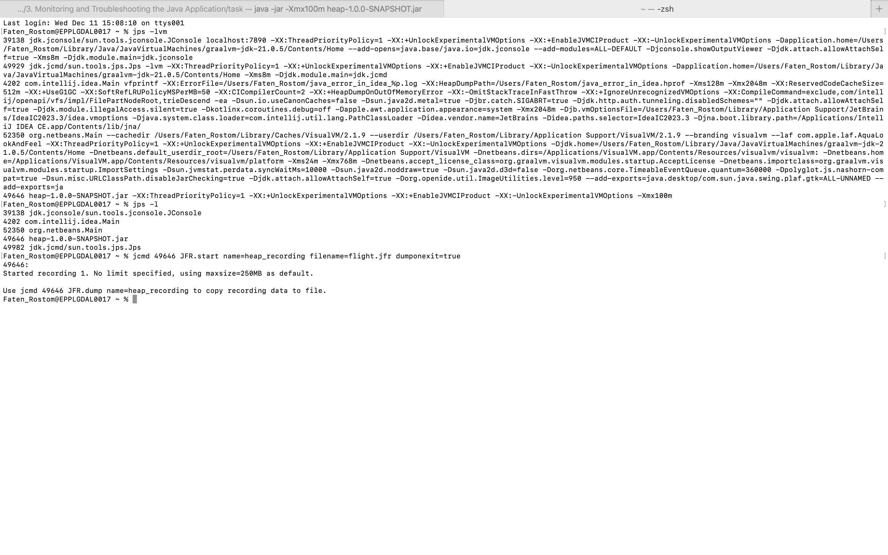

## jinfo
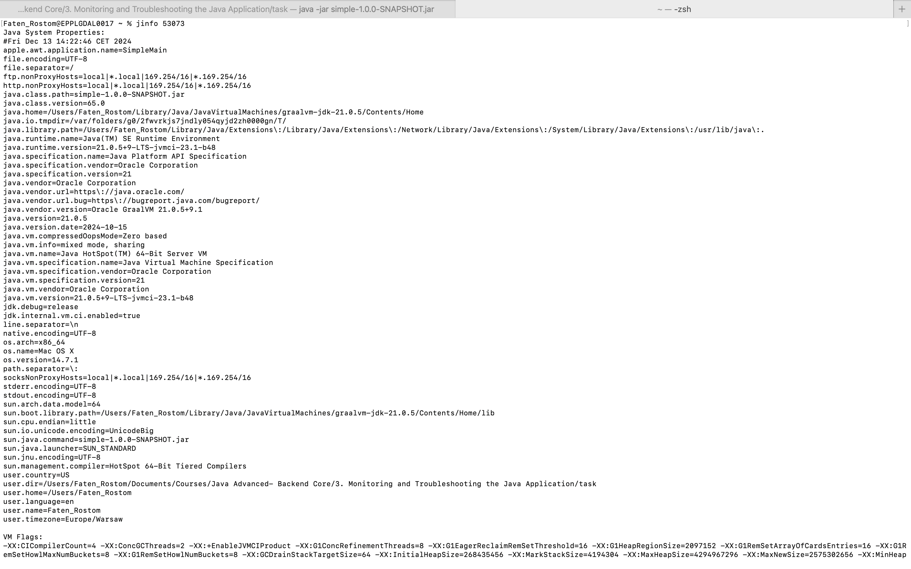
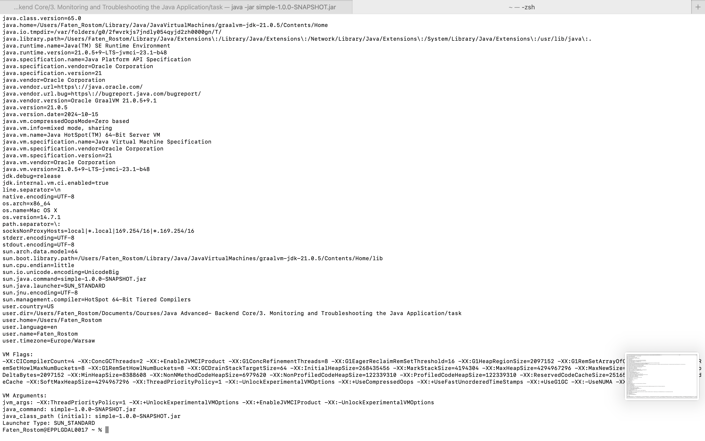